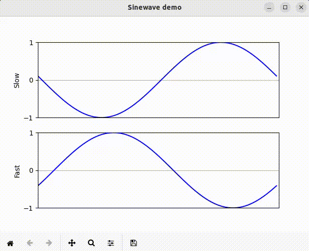

# RealtimePlotter

This package provides a Python class that handles the tricky parts of animated
data-plotting in real time: the animation itself, as well as the threading
(asynchronous execution) required to coordinate the data acquisition with the
animation.  As shown in this [example](slowfast.py), you pass a data-source
object to the RealtmimePlotter constructor, along with the Y-axis limits.
Calling the ```start()``` method of the RealtimePlotter object launches the
plot, calling the ```read()``` method of your data-source object on a separate
thread.  The [example](slowfast.py) includes a short time delay to simulate
the data-acquisition process in an actual application, without which the
display may not work correctly.

Install in the usual way:

```
pip3 install -e .
```

